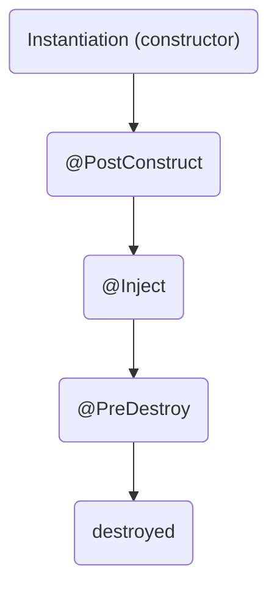
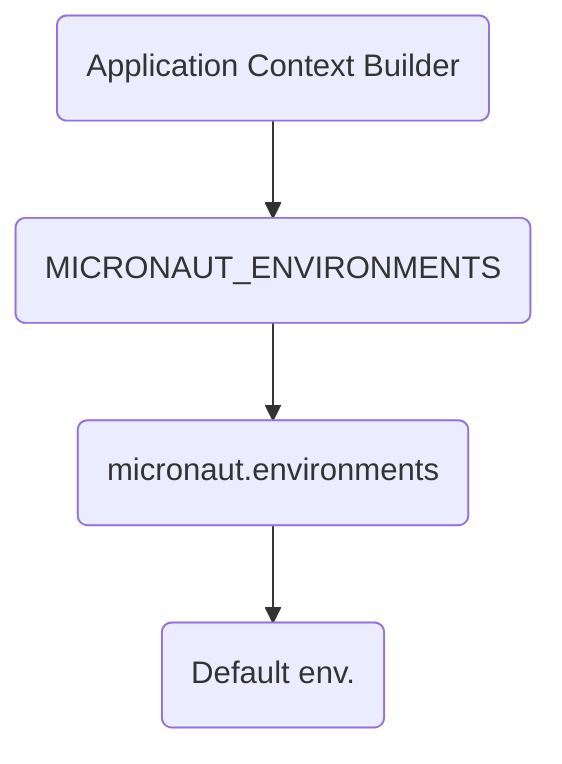

# Micronaut Fundamentals
## Study Notes

Reference\
https://docs.micronaut.io/index.html \
https://docs.micronaut.io/latest/guide/ 

Easter egg: micronaut-banner.txt in resources folder
ASCII Text art generator 

### Micronaut CLI

```bash
mn create-app <<app_name>>
```

### Annotations

`@Inject` - Prefered way constructor injection + makes the fields immutable    
   * BeanContext.run   
   * ApplicationContext.run   
   
`@Named`   
`@Qualifier`   
`@Primary`   
`@Second`    
`@Replaces` - Bean replacement 3rd-party libraries   

### Bean lifecycle: instantiation




### Bean scopes
`@Singleton` - lazy initialization, only when a method call is done   
`@Context` - one instance per context, but eager initialization.. during startup  
`@Prototype` - will instantiate a new bean everytime it gets injected   
`@ThreadLocal`   
`@Infrastructure`   
`@RequestScope`   
`@Refreshable` - we can refresh the state of bean  using the refresh endpoint   

`@Factory` - when using 3rd-party libraries we want to use their classes as beans   
`@Bean` - a method declared inside the factory class which returns a new object from 3rt party library   


### Bean introspection
Getting reflection types fields in AOT (_Ahead of Time_) compilers
Not every class is available for instrospection 

```java
@Instrospected
BeanIntrospection.getInstrospection()
```


### Configuration
Environment priorities, from top (**_highest_**) to down (**_lowest_**) ones:




#### Property Sources (from High to Low)   
Command line arguments   
* SPRING_APP_JSON    
* MICRONAUT_APP_JSON   
* Java System Properties   
* OS environment variables   
* micronaut.config.files   
* application-{environment}.{extension}   
* application.{extension}   

{extension}= .yaml, .properties or .json   

ENVIRONMENT VAR -> good practice for variables who change frequently (like feature flags) which doesn't need the app to be repackaged

```java
@Value("{lights.default.color}")
Field 

@Property(name = "lights.default.color")
Field

@ConfigurationProperties("lights.default")
Class
```

How to pass an environment to Micronaut ?    
Environment variables= MICRONAUT_ENVIRONMENTS=dev    

All letters in uppercase and all dots for underscores    
LIGHTS_DEFAULT_COLOR=red    


Passing configurations through Maps and Lists   
```java
@EachProperty(value = "updates")
Class

@Property(name = "updates.urls")
List<String> urls;

@MapFormat( transformation= MapFormat.MapTransformation.FLAT )
Map<String, String> thresholds;

@EachProperty(value = "updates.urls", list= true)
Class
```

and those are combined with a `@Factory` class
```java
@Context
@Factory
Class {

    @EachBean(UpdatesSourceConfiguration.class)
    method

}
```

`@Parameter` in constructor   
Will inject the property key in the name field   
In case of map transformation.. we need to tell Micronaut which property will be the key for our map in the fields of our class   


### Aspect Oriented Programming
Programming paradigm that aims to increase modularity by allowing the separation of cross-cutting concerns   

Aspect is executed aside method calls   

#### Around Advice
Ex.: Logs and statement everytime a method call is done.. execute some code before hand   

```java
@Documented
@Retention(RUNTIME)
@Target({TYPE, METHOD})
@Around
public @interface Log {}

@Singleton
@InterceptorBean(Log.class)
public class LogInterceptor implements MethodInterceptor<Object, Object> {
}
```

Mark the methods you would like to intercept with the `@Log` annotation


### Introduction Advice
Are placed in interfaces and abstract classes, which do not have a default implementation

```java
@Introduction
@Bean
@Documented
@Retention(RUNTIME)
@Target({ TYPE, ANNOTATION_TYPE, METHOD})
public @interface UpdatesClient {}

@Singleton
@InterceptorBean(UpdatesClient.class)
public class UpdatesInterceptor implements MethodInterceptor<Object, Object> {}

@UpdatesClient
interface UpdatesControlCenter {
    @UpdatesClient
    public String getLatestVersion();
}
```


### Built-in Advices
`@EventListener` - acts on application startup event, file changes, refresh event   
`@Valid`   
`@NotNull`   
`@Min`   
`@Max`   
`@Cacheable`    
`@CachePut`   
`@CacheInvalidate`   
`@Retryable`    
`@CircuitBreaker`    
`@Scheduled` - tasks to be executed in a certain time/period.. runs tasks in sequence. So if tasks take longer than the fixedRate they will be executed right away.. That's when fixedDelay takes place   

    - fixedRate = 10m   
    - fixedDelay = 1h   
    - cron = 0 8 * * *    
    - initialDelay = 1m    


### HTTP Services
`@Controller`    
`@Get`    
`@Post`    
`@Put`    
`@Patch`    
`@Delete`    
`@Head`    
`@Options`   
`@Trace`   

`@QueryValue`   
`@CookieValue`    
`@Header`    
`@PathVariable`    
`@RequestAttribute`    

Micronaut embeds Netty web server

```java
@Get
public String getRecipes(@QueryValue Optional<String> query) {}

@Post
public Recipe createRecipe(@Body Recipe recipe) {}
```
    
### Error Handling
#### Local Error Handling
`@Error` -> method in your class    
    
```java
public HttpResponse<JsonError> jsonError(HttpRequest request, JsonParseException e) {
   return HttpResponse.badRequest(.new JsonError( e.getMessage() ) );
}
```

#### Global Error Handling
```java    
@Error( global = true, status = HttpStatus.NOT_FOUND )
public HttpResponse<JsonError> notFound( HttpRequest request ){
   return HttpResponse.notFound().body( error );
}
```

#### Exception Handler -> listen to any specific type of error thrown at the app level (custom exceptions)

```java
public class InvalidTemperatureException extends RuntimeException{}

public class ErrorMessage {} // DTO

@Singleton
public class InvalidTemperatureExceptionHandler implements ExceptionHandler< InvalidTemperatureException, HttpResponse<ErrorMessage>> {
    public HttpResponse<ErrorMessage> handle( HttpRequest request, InvalidTemperatureException exception ) {
       return HttpResponse.badRequest( errorMessage );
    }
}
```

### API Versioning

Micronaut versioning is not enabled by default.. So we need to add the versioning mechanism at `application.yml`   

```yaml    
router:
   versioning:
       enabled: true
       parameter:
           enabled: true
           names: 'v,api-version'
       header:
           enabled: true
           names: 
               - 'X-API-VERSION'
               - 'Accept-Version'
```    

```java    
@Version("1")
@Get("/sensor/status")
public String getStatus1() {}

@Version("2")
@Get("/sensor/status")
public String getStatus2() {}
```
    
Callign via insomnia
GET -> http://localhost:8080/sensor/status?v=1    
       http://localhost:8080/sensor/status?v=2    


HTTP Header
GET -> http://localhost:8080/sensor/status    
     X-API-VERSION = 1    


### Management Endpoints
* /beans
* /health
* /info
* /loggers
* /metrics
* /refresh
* /routes
* /env
* /threaddump
* /caches
* /stop

Need to add an additional dependency to the `build.gradle`
```gradle
dependencies {
    implementation("io.micronaut:micronaut-management")
}
```    


### HTTP Clients
Reactive clients (RxJava) - non blocking io calls .. do not impact the client waiting for a response    

#### Low-level Client

```java
@Client("http://pluralsight.com")
RxHttpClient client;
```

#### Declarative Client
```java
@Client
interface { 
}
```

Uses the same annotations: `@Get`, `@Post`, `@QueryValue` and so on   

##### RxJava Return Types
`Observable` = single object
`Completable` = maybe
`Flowable` = list of objects, multiple objects ... open stream -> event -> ... -> event -> close stream
`Single` = stream events.. open stream -> event -> close stream


Declarative clients must be an interface! 
Requires a lot less code than low level client, much simpler

Differences between `Single` != `Flowable` 


`@Retryable(attempts=3, delay=2s)` - micronaut client will not immediately fail as it discover it cannot reach the server .. we'll retry the request with a couple of seconds between then 

The waiting time is exponential ! First 2s, after 4s, 16s and so on

`@CircuitBreaker`- similar to the retryable annotation, with a couple of twists.. if it encounter too many erros coming from a client, it will decouple the circuit (stop making requests) for a specific duration (configurable) .. like 30s.. so it can continue retrying after that period   

Prevents overloaded requests    

It prevents the server to be flooded of 500 internal server erors.. since the circuit is off, it immediately returns an error to the client    

`@Fallback` - provides a default behavior when our server is unreachable.. like getting the data I need from a cache

```java
@Fallback 
class implements DeclarativeCalibrationClient {}
```
 And returns some dummy results 


### Kafka
Event-driven microservices 

Micronaut supports:
* Apache Kafka
* RabbitMQ
* Nats.io

Kafka topics lives in Kafka brokers

#### Kafka Producers

```java
@KafkaClient
interface { 

    @Topic("${kafka.topic.notifications}")
    Single<> publishNotification(@KafkaKey Id id, Notification notification);

}
```

Kafka Events are composed of
* Key
* Value
* Header(s)
* Timestamp

`docker-compose.yaml` - deploy a Kafka cluster in our local machine

```docker
docker compose up -d
```


Add in `build.gradle` the Kafka dependency
```gradle
implementation("io.micronaut.kafka:micronaut-kafka")
```

`application.yml` - Add the kafka bootstrap property

Any properties start with `"kafka.producers.default.{property}"` will be provided to the **embedded producer** 

```yaml
kafka:
   bootstrap:
       servers: localhost:9082
   topic:
       notifications: <<topic_name>>
   producers:
       retries: 5
```       


#### Kafka Consumers

```java
@KafkaListener(groupId = "news.listener")
public class NewsListener {

   @Topic("{kafka.topic.news}")
   public void receive(@KafkaKey Id id, News news) {
   }
}
```

groupId -> make sure each Kafka Listener has a unique id

### Streaming Applications
Takes 1 event as input, and produces one or more events as outputs
Consuming event in one topic, producing to another topic

"news" topic -> streamingFilter -> "filtered-news" topic

Use cases:
- filter
- map
- group
- aggregate
- join

`build.gradle` -> Add a new dependency:
```gradle
dependencies {
    implementation("io.micronaut.kafka:micronaut-kafka")
    implementation("io.micronaut.kafka:micronaut-kafka-streams")
}
```

```java
@Factory
public class NewsFilterStream {
    @Property( name= "kafka.topic.news" )
    private String news;

    @Property(  name= "kafka.topic.filtered-news" )
    private String filteredNews;

    @Singleton
    @Named("news-filter")
    KStream<String, String> newsFilterStream(ConfigurationStreamBuilder builder) {
         ...
         KStream<String, String> source = builder.stream( news );
         source.filter( (key, value) -> value.contains(FILTER) ).to( filteredNews );
         return source;
    }
}
```

### Testing Micronaut Applications

`build.gradle` -> Add necessary testing unit dependencies
```gradle
dependencies {
   ...
   testAnnotationProcessor "io.micronaut:micronaut-inject-java"
   testImplementation("org.junit.jupiter:junit-jupiter-api");
   testImplementation("io.micronaut.test:micronaut-test-junit5:2.3.7")
   testRuntimeOnly("org.junit.jupiter:junit-jupiter-engine:5.7.1")
}
```

```java
@MicronautTest
public class RecipesControllerTest {

    @Inject
    @Client("/")
    RxHttpClient client;

    @Test
    @Order(1)
    @DisplayName("Should GET recipes successfully")
    void shouldGetRecipesSuccessfully {
        // GIVEN - prepares the input used by the test
        // WHEN - executes the code we want to test
        // THEN - compare the result with our expectations
        assertEquals( HttpStatus.OK, response.getStatus() );
        assertEquals( 3, response.body().size() );
    }

   @Test
   @Order(2)
   @DisplayName("Should return error on invalid temp")
    void shouldReturnErrorOnInvalidTemp() {
         assertEquals( HttpStatus.BAD_REQUEST, exception.getStatus() );
    }
}
```


#### Mocking Services
`build.gradle` -> Add **mockito** dependency

```gradle
dependencies {
   ...
   testImplementation("org.mockito:mockito-all:1.10.19")
}
```

**Mockito** is a testing library that allow us to mock the behaviour of our beans

```java
@MicronautTest
public class CalibrationsControllerTest {

    @MockBean(DeclarativeCalibrationsClient.class)
    DeclarativeCalibrationsClient calibrationsClient() {
        return Mockito.mock( DeclarativeCalibrationsClient.class );
    }
}
```

#### Kafka Unit Testing
`build.gradle` -> Add test *containers* dependency
```gradle
dependencies {
    ...
    testImplementation("org.textcontainers:kafka:1.15.3")
}
```
 

### Cloud-native features

#### Distributed Configuration
Instead of storing configuration files, we store it in a distributed configuration store   
The store is usually deployed in a high-availability format, so it provides resiliency    
All our application requires is the connection URL    
Ideal por properties/secrets, this way our app doesn't need to be repackaged any time configurations changes    

Supported Distributed Configuration:
* HashiCorp Consul
* Spring Cloud Config
* AWS Parameter Store
* HashiCorp Vault
* Oracle Cloud Vault

#### Service Discovery
A Service Registry will know addresses of all deployed applications

* HashiCorp Consult
* Eureka
* Kubernetes
* AWS Route 53
* Manual Service Discovery

#### Client-side Load Balancing
Let the client applications do the load balancing by themselves   
The client decides which applications connect to   

* Netflix Ribbon


Distributed Tracing
Serverless Functions
* AWS Lambda
* Google Cloud Function
* Google Cloud Run
* Azure Function

```bash
mn create-function-app mn-text-processor --features google-cloud-function
```

Packaging can be made by gradle, zipping the code base and all required dependencies in a single jar

```bash
gradle clean shadowJar
cd build/libs
```


### Micronaut Security
Authentication - supported mechanisms:
* Basic authentication
* Session authentication
* JSON web token (JWT)
* LDAP
* custom

#### JWT
* Signature Validation
* Token Generation
* Encryption
* Claims Generations
* Claims Validation

OAuth 2.0 and OpenID Connect - providers supported:
* Okta
* Auth0
* AWS Cognito
* Keycloak
* Google
